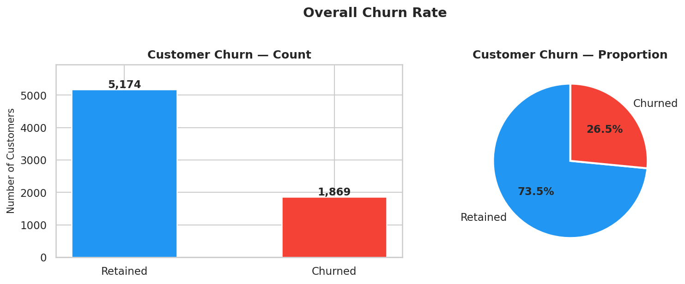
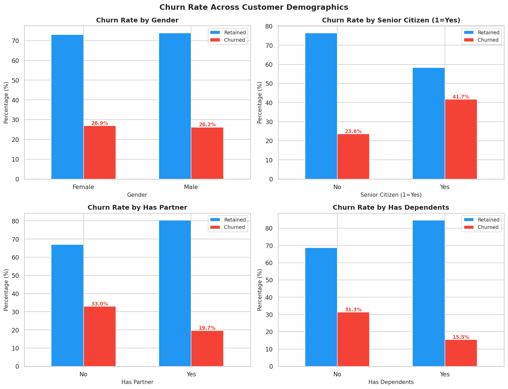
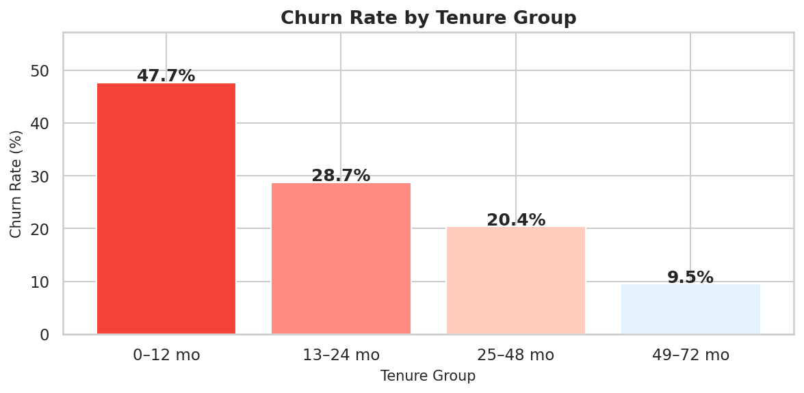
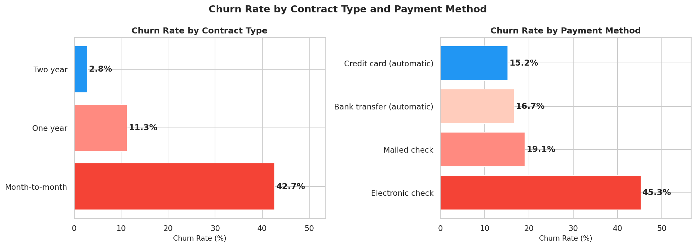
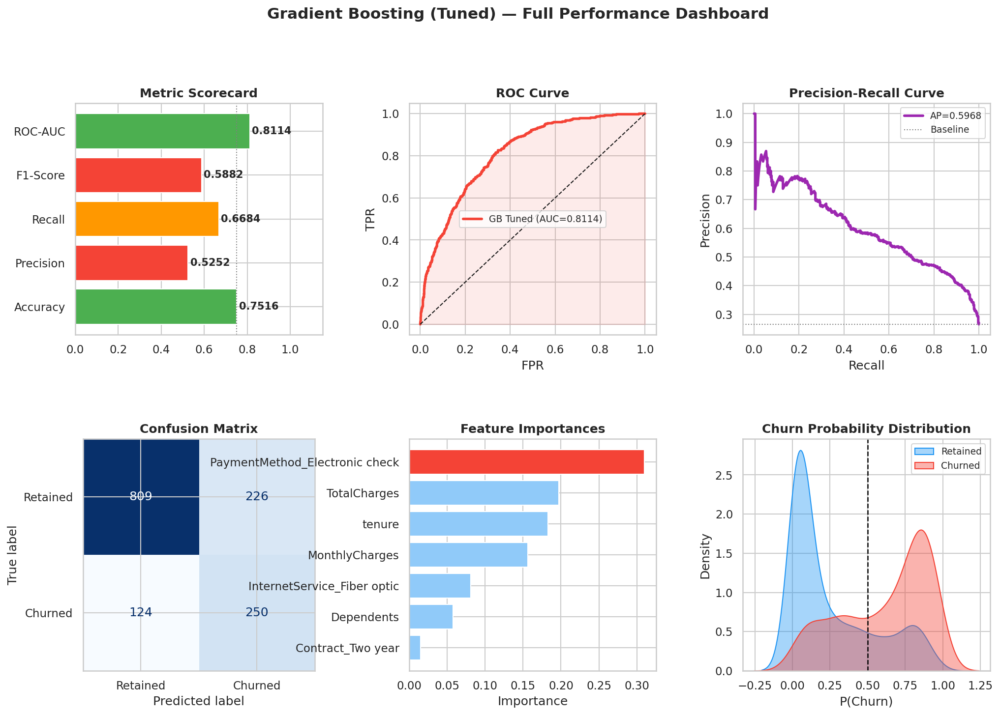
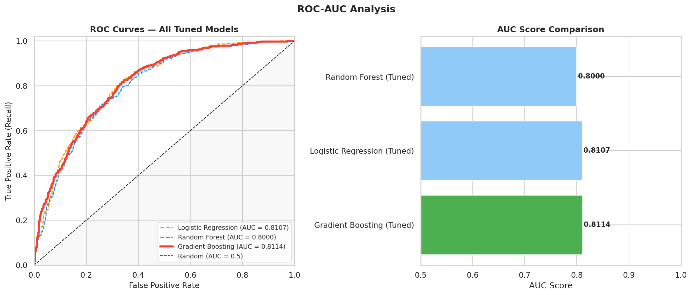

# Customer Churn Analysis and Prediction
### SaiKet Systems — Data Science Internship


---

## Overview

This repository contains the complete data science pipeline for the **Customer Churn Analysis and Prediction** project, completed as part of the SaiKet Systems Data Science Internship (ID: SKS/A2/C115874).

The project analyses a telecommunications customer dataset of **7,043 records** to:
- Identify the key drivers of customer churn through exploratory analysis
- Build and evaluate machine learning models that predict which customers are likely to leave
- Provide interpretable, actionable insights for business retention strategy

**Best Model:** Gradient Boosting Classifier (Tuned)  
**ROC-AUC:** 0.81 | **Recall:** 66.8% | **F1-Score:** 0.5882

---

## Table of Contents

- [Project Structure](#project-structure)
- [Dataset](#dataset)
- [Pipeline Summary](#pipeline-summary)
- [Key Results](#key-results)
- [Visualisations](#visualisations)
- [Setup & Reproduction](#setup--reproduction)
- [Dependencies](#dependencies)
- [Author](#author)

---

## Project Structure

```
saiket-data-science-internship/
│
├── notebooks/                          # One notebook per completed task
│   ├── Task1_Data_Preparation.ipynb
│   ├── Task2_Exploratory_Data_Analysis.ipynb
│   ├── Task4_Churn_Prediction_Model.ipynb
│   └── Task5_Model_Evaluation_Interpretation.ipynb
│
├── data/                               # Raw and processed datasets
│   ├── telco_churn.csv                 # Original dataset
│   ├── telco_churn_processed.csv       # Cleaned & encoded dataset
│   ├── X_train.csv                     # Training features
│   ├── X_test.csv                      # Testing features
│   ├── y_train.csv                     # Training labels
│   └── y_test.csv                      # Testing labels
│
├── models/                             # Saved model artifacts
│   ├── best_model.pkl                  # Tuned Gradient Boosting classifier
│   ├── feature_selector.pkl            # SelectFromModel (RF-based)
│   └── scaler.pkl                      # StandardScaler
│
├── visuals/                            # All generated plots
│   ├── eda/                            # EDA visualisations (8 plots)
│   ├── task4/                          # Model comparison plots (4 plots)
│   └── task5/                          # Evaluation plots (7 plots)
│
├── docs/
│   └── SKS_Churn_Pipeline_Breakdown.docx   # Beginner-friendly pipeline guide
│
├── requirements.txt
├── .gitignore
└── README.md
```

---

## Dataset

**Source:** IBM Telco Customer Churn Dataset  
**Records:** 7,043 customers | **Features:** 21 columns | **Target:** `Churn` (Yes/No)

| Feature | Description |
|---------|-------------|
| `tenure` | Months the customer has been with the company |
| `MonthlyCharges` | Monthly bill amount (USD) |
| `TotalCharges` | Total amount billed over tenure |
| `Contract` | Contract type: Month-to-month, One year, Two year |
| `PaymentMethod` | How the customer pays their bill |
| `InternetService` | DSL, Fiber optic, or None |
| `Churn` | **Target variable** — Yes (churned) or No (retained) |

> Overall churn rate: **26.54%** (1,869 out of 7,043 customers)

---

## Pipeline Summary

### Task 1 — Data Preparation
- Loaded dataset and performed initial exploration (shape, dtypes, statistics)
- Identified and fixed `TotalCharges` dtype issue (blank strings → NaN)
- Imputed 11 missing `TotalCharges` values with `MonthlyCharges` (new customers, tenure = 0)
- Label-encoded binary columns; One-Hot encoded multi-class columns
- Split data 80/20 with stratification → **5,634 train / 1,409 test**

### Task 2 — Exploratory Data Analysis
- Calculated and visualised overall churn rate (26.54%)
- Analysed churn across demographics: gender, senior citizen status, partner, dependents
- Investigated tenure distribution — customers in months 0–12 churn at **~48%**
- Compared churn by contract type and payment method
- Produced correlation heatmap of key features against churn target

### Task 4 — Churn Prediction Model
- Applied **SMOTE** to training set to address class imbalance (→ 4,139 per class)
- Applied **StandardScaler** (fitted on train only)
- Benchmarked 6 classifiers: Logistic Regression, Decision Tree, Random Forest, Gradient Boosting, SVM, KNN
- Used **SelectFromModel** (RF importance, mean threshold) → reduced to **7 key features**
- Hyperparameter tuning via **GridSearchCV** (5-fold stratified CV, F1 optimisation)
- **Winner: Gradient Boosting** (`learning_rate=0.1`, `max_depth=5`, `n_estimators=200`, `subsample=0.8`)

### Task 5 — Model Evaluation & Interpretation
- Full test-set evaluation: Accuracy, Precision, Recall, F1, ROC-AUC
- Normalised and raw confusion matrices
- ROC curves and AUC comparison for all 3 tuned models
- Precision-Recall curves with average precision scores
- Feature importance interpretation (Gradient Boosting)
- Threshold optimisation analysis (optimal threshold ≈ 0.37)
- 6-panel performance dashboard

---

## Key Results

### Model Performance — Gradient Boosting (Tuned)

| Metric | Score |
|--------|-------|
| Accuracy | 75.16% |
| Precision | 52.52% |
| Recall | 66.84% |
| F1-Score | 0.5882 |
| **ROC-AUC** | **0.8114** |

### Top Churn Drivers (Feature Importances)

| Rank | Feature | Insight |
|------|---------|---------|
| 1 | `tenure` | Longest-tenured customers almost never churn |
| 2 | `TotalCharges` | Proxy for tenure × spend; reflects commitment |
| 3 | `MonthlyCharges` | Higher bills drive price sensitivity |
| 4 | `Contract_Two year` | Two-year contracts suppress churn to ~3% |
| 5 | `PaymentMethod_Electronic check` | ~45% churn rate — highest risk payment type |
| 6 | `InternetService_Fiber optic` | Premium tier, higher competitive alternatives |
| 7 | `Dependents` | Mild protective effect on churn |

### EDA Highlights

| Finding | Value |
|---------|-------|
| Overall churn rate | 26.54% |
| Churn rate — 0 to 12 months tenure | ~48% |
| Churn rate — 49+ months tenure | ~7% |
| Churn rate — Month-to-month contract | ~43% |
| Churn rate — Two-year contract | ~3% |
| Churn rate — Electronic check users | ~45% |
| Churn rate — Senior citizens | ~41% |

---

## Visualisations

### EDA
| | |
|---|---|
|  |  |
|  |  |

### Model Performance Dashboard


### ROC Curves


---

## Setup & Reproduction

### 1. Clone the repository
```bash
git clone https://github.com/Tosa9/saiket-data-science-internship.git
cd saiket-data-science-internship
```

### 2. Install dependencies
```bash
pip install -r requirements.txt
```

### 3. Launch Jupyter
```bash
jupyter notebook
# or
jupyter lab
```

### 4. Run notebooks in order

> ⚠️ Run them sequentially — each notebook saves files that the next one loads.

| Order | Notebook | Output Files |
|-------|----------|--------------|
| 1st | `Task1_Data_Preparation.ipynb` | `telco_churn_processed.csv`, train/test splits |
| 2nd | `Task2_Exploratory_Data_Analysis.ipynb` | `visuals/eda/` plots |
| 3rd | `Task4_Churn_Prediction_Model.ipynb` | `models/*.pkl`, `visuals/task4/` plots |
| 4th | `Task5_Model_Evaluation_Interpretation.ipynb` | `visuals/task5/` plots |

> ⏱️ **Note:** Task 4 runs GridSearchCV which takes approximately 8–15 minutes on a standard laptop. A commented-out block in the notebook lets you skip the grid search and load pre-fitted models instead.

---

## Dependencies

```
pandas>=1.5.0
numpy>=1.23.0
matplotlib>=3.6.0
seaborn>=0.12.0
scikit-learn>=1.2.0
imbalanced-learn>=0.10.0
joblib>=1.2.0
notebook>=6.5.0
```

Install all at once:
```bash
pip install -r requirements.txt
```

---

## Documentation

A detailed, beginner-friendly pipeline breakdown is available in [`docs/SKS_Churn_Pipeline_Breakdown.docx`](docs/SKS_Churn_Pipeline_Breakdown.docx).

It covers every step in plain English, with code blocks, interpretation tables, a full glossary, and a how-to-reproduce guide — written for readers with no prior data science experience.

---

## Author

**Omokhoa Oshose Tosayoname**  
Mechanical Engineering Graduate | Data Science & Analytics  
University of Nigeria, Nsukka  

- GitHub: [@Tosa9](https://github.com/Tosa9)  
- LinkedIn: [Omokhoa Oshose Tosayoname](https://www.linkedin.com/in/omokhoa-tosayoname)  
- Twitter/X: [@Tosa_omokhoa](https://twitter.com/Tosa_omokhoa)  

---

*Completed as part of the SaiKet Systems Data Science Internship — April 2026*  
*Intern ID: SKS/A2/C115874*

[](https://www.saiket.in)
